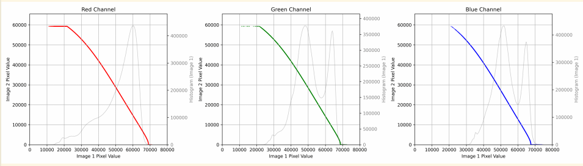
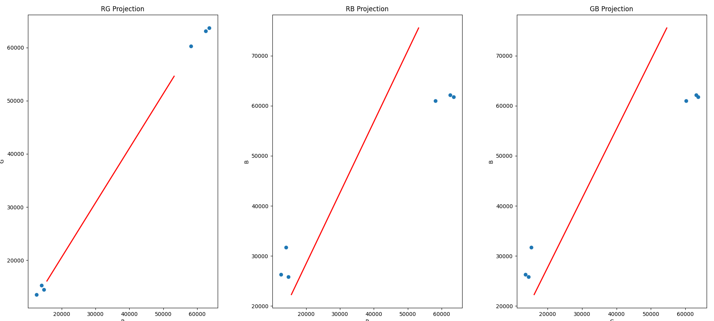
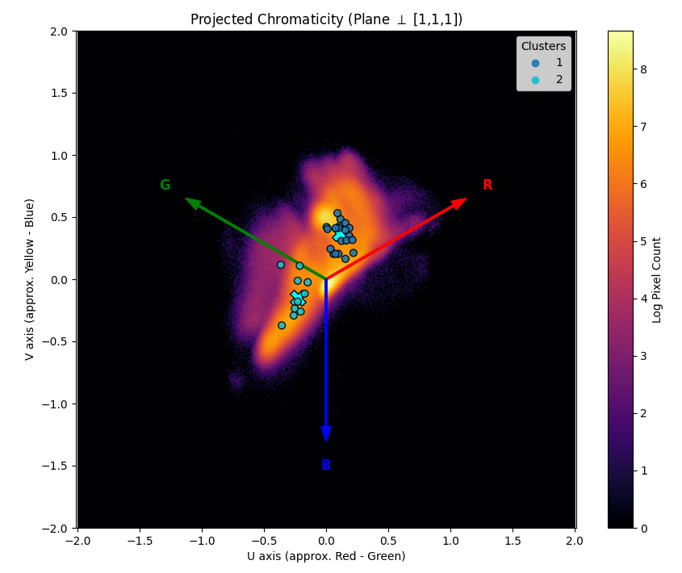

# Usage
`python3 n2p_2026.py`

# Installation
Make sure the proper python modules are installed; sorry, you're on your own here…

# Input data
You are in a directory containing a series of RAW files (the script is currently only looking for `*.ARW` files, but that's easily changed). For each image on your roll, you take a scan with red backlight, a scan with green backlight and a scan with green backlight.

# Output data
You'll find out ;)

---

In these notes you'll read my personal quest for finding an automated process for digitizing and processing color negatives. I think I now have reached a workflow that I can perfectly live with for the rest of my life—or how many times did I say the before…?

I have been trying all available tools, my notes mention FilmLab, RawTherapee, Darktable, XnView, digikam, Negatron.io, Color.io, Film Q,… and no, not Negative Lab Pro, because for the 15 color films that I shoot on average per year (aside to some black and white), the price is just too high. Processing scans in these tools is a hit-and-miss and most often requires much manual adjustments, if a decent result can be reached at all.

Intermittantly, I did some reading, about how color emulsions work and the role of light sources for digitization. I was experimenting with led lights and amoled screens as backlight to get more information out of the film dyes.

I have been through a stage of using scripted command line tools, like dcraw and imagemagick, to do layer splitting and implement color correction using a well-known method of auto-leveling the color layers separately.

Then I came across a github project called "Film Scan Converter", that I forked to make it into a scriptable command line tool, implementing some improvements for better automation, still based on the layer auto-leveling. 

The first breakthrough that I made was buying an RGB light, a Neewer SL90, to use as backlight. I use it to take three separate scans of each negative, one with pure red, one with pure green and one with pure blue as backlight. Because I want the digital images to be as bright as possible without clipping, I adjust the brightness to compensate for the negative film orange cast: red is set to 90, green to 255 and blue to 212. With these settings programmed as presets in the accompanying app and my camera set to a fixed aperture and shutter speed, I can digitize a complete roll in 5 minutes!

I went through a stage when I was trying to understand the relation between pixel values and actual light. This was very interesting. I learnt the importance of using linear pixel values from the raw files after digitization. I reproduced mathematically how the light of a scene exposes the film, activates the dyes and after development produces a density on the film, how the backlight during digitization is transmitted by the film and captured by the sensor to produce pixel values that are, after a whole series of math formulas, plain and simple linear to the light from the scene (purely technical, it's not linear, but homogeneous)! This means that if you have two areas in a scene where the one is two times as bright as the other (one stop), the ratio of their pixel values after digitization is $2^{\gamma}$, with $\gamma$ the 'gamma' of the film. Or when the brightness ratio of the scenes is 4 (two stops), the pixel value ratio is $4^{\gamma}$ and so on.

At some point, I was implementing this whole cascade of gammas, logarithms, densities in my postprocessing from linear raw negative digitized pixels to a visible picture, only to find out that the curves that these formulas actually produce are basically very close to the un-scientific layer-by-layer auto-leveling in non-linear RGB color space that I was so desperately trying to improve.

I started to realize that whatever postprocessing method I would devise, it will always fail on some pictures that have deviating colors in the scene. Because I typically postprocess a complete roll of negatives, most of which are shot with similar lighting conditions, my next plan was to use a common processing for all pictures.

My mathematical understanding of linear pixel values focused me on color correction by *scaling* the linear negative color layers independently. Only after color correction, the image is inverted and auto levels are applied and gamma, to obtain proper black and white points and contrast. Color correction must be done on the linear (homogeneous) negative pixel values and only through scaling, because they hold the linear relation to the light (colors) in the scene, which is lost when inversion or levels are applied.

Finding the values for the scaling factors is nothing more than finding the pixel value in the image that represents a neutral (gray) color. That's easier said than done! My first attempts were based on the assumption that the overall brightest and darkest area's in an image most probably represent neutral colors (black or white).

In the meanwhile, I embraced the power of AI and ditched the command line scripting and tweaking of existing code that I found on github, and with the help of chatgpt for the conceptual brainstorming and google gemini for the coding in vscode, I built my own application from scratch. Its requirements are simple: a command line tool that you execute in a directory containing a set of raw image files (for each negative a red, a green and a blue digitization) and that produces a set of jpg files, ready to be uploaded to google photos.

My first implementation was collecting the brightest and lowest pixels for all images and calculating a regression line to estimate the neutral color. This was not bad, but the main problem is that these black and white pixels lie in the zone where the behaviour of film is typically *not* obeying the mathematical linearity.

I came across a new intuition. Increasing a pixel in brightness in linear space (multiplication of all channels by the same constant), is adding constant $(k,k,k)$ in log-density space, or a translation in the direction of the unity vector $(1,1,1)$. To eliminate the brightness dimension from an image, all pixels can be projected along the unity vector on a plane through the origin that is perpendicular to the unity vector. This way you create a kind of *heat map* representing the chromatic data in the image. Assuming that an images, and for sure a set of images, contain all colors, although not in the same amounts, some clever processing can be found to estimate the neutral color based on this chromatic heat map. The sweet spot lies somewhere between finding the geographic middle and the gravity center of the heat map.

In practice, I'm dividing the chromatic plane using a grid, counting for each cell the number of pixels in the set of images having that color (i.e. ignoring the brightness), then filtering out cells with very low pixel counts (probably noise artifacts), convert the grid to a mask (i.e. just looking if the cell holds pixels, yes or no) and calculating the median coordinates of the mask. Convert these back into linear space and I have my scaling factors!

A roll often contains images shot at different occasions, in different lighting conditions, each requiring their own correction factors. I could solve this by organizing my raw images in different directories, grouped by lighting conditions, and run the postprocessing on each directory separately. But when you look at the graph that represents the chromaticity plane, you can clearly see how the pictures with similar lighting conditions are forming clusters. There are specialized libraries that can identify these clusters and allow me to fully automatically group the pictures in my roll by similar lighting conditions and calculate a proper color correction for each cluster, still taking advantage of having multiple images as input for the color correction, so it is not fooled by images with atypical colors in the scene and making the colors of the output images consistent.

Gemini also helped me to implement multiprocessing, so this job is now using all cores of my CPU. And just for the record, my postprocessing also involves a vignetting correction, because my Pentax M42 50mm macro lens at $f/8$ is probably not the best in class. And the application supports half-frame cameras, for which each image is split in half before processing. That option is the only step that is not fully automatic, it is triggered by a command line flag `-h`.

I'm proud of my work, because the main concepts are mine, although they're probably not new, and I enjoyed the programming, implementing one concept after another with tremendous pace, thanks to the help of AI, withouth which disillusionment would have been my share, and premature abandonement that of the project, I'm sure.

